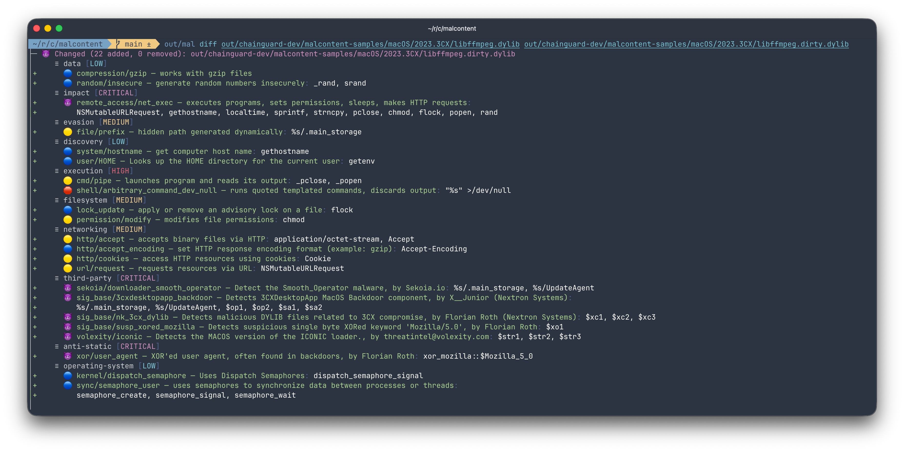
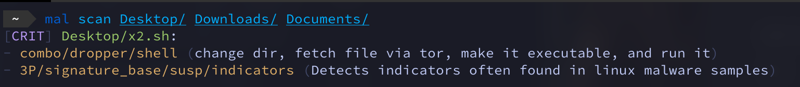
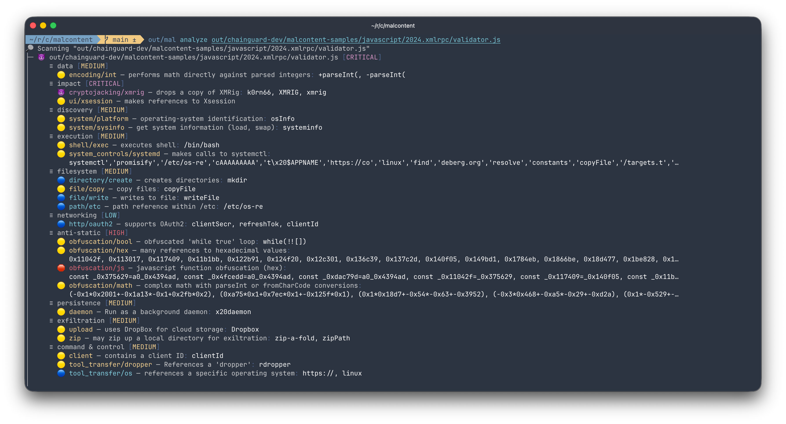

# malcontent

[](https://github.com/gojp/goreportcard/blob/master/LICENSE)
[](https://github.com/chainguard-dev/malcontent/releases/latest)
[](https://www.bestpractices.dev/projects/9633)
[](https://scorecard.dev/viewer/?uri=github.com/chainguard-dev/malcontent)
[](https://goreportcard.com/report/chainguard-dev/malcontent)

```text
 _ _    _.  .    _   _    _  .  ___   _.   _  .  ___
( | )  (_|  |_  (_  (_)  ( \_)   |   (/_  ( \_)   |

            subtle malware discovery tool
```

malcontent discovers supply-chain compromises through the magic of context, differential analysis, and 14,000+ YARA rules.


```
 ________      ________      ________      ________
|        |    |        |    |        |    |        |
| v1.0.0 | => | v1.0.1 | => | v1.0.2 | => | v1.0.3 |
|________|    |________|    |________|    |________|

               unchanged     HIGH-RISK     decreased
               risk          increase      risk

```

malcontent has 3 modes of operation:

* ✨ `diff`: risk-weighted differential analysis between two programs
* 🕵️‍♀️ `analyze`: deep analysis of a program's capabilities
* 🔍 `scan`: basic scan of malicious content

malcontent is at its best analyzing programs that run on Linux. Still, it also performs admirably for programs designed for other UNIX platforms such as macOS and, to a lesser extent, Windows.

## ⚠️ Malware Disclaimer ⚠️

Due to how malcontent operates, other malware scanners can detect malcontent as malicious.

Programs that leverage Yara rules will often see other programs that also use Yara rules as malicious due to the strings looking for problematic behavior(s).

For example, Elastic's agent has historically detected malcontent because of this: https://github.com/chainguard-dev/malcontent/issues/78*.

>  \*Additional scanner findings can be seen in [this](https://www.virustotal.com/gui/file/b6f90aa5b9e7f3a5729a82f3ea35f96439691e150e0558c577a8541d3a187ba4/detection) VirusTotal scan.

## Features

* 14,500+ [YARA](YARA) detection rules
  * Including third-party rules from companies such as Avast, Elastic, FireEye, Mandiant, Nextron, ReversingLabs, and more!
* Analyzes binary files in most common formats (ELF, Mach-O, a.out, PE)
* Analyzes code from most common languages (AppleScript, C, Go,  Javascript, PHP, Perl, Ruby, Shell, Typescript)
* Transparent support for archives (apk, tar, zip, etc.) & container images
* Multiple output formats (JSON, YAML, Markdown, Terminal)
* Designed to work as part of a CI/CD pipeline
* Supports air-gapped networks

## Modes

### Diff

malcontent's most powerful method for discovering malware is through differential analysis against CI/CD artifacts. When used within a build system, malcontent has two significant contextual advantages over a traditional malware scanner:

* Baseline of expected behavior (previous release)
* Semantic versioning that describes how large of a change to expect


Using the [3CX Compromise](https://www.fortinet.com/blog/threat-research/3cx-desktop-app-compromised) as an example, malcontent trivially surfaces unexpectedly high-risk changes to  libffmpeg:



Each line that begins with a "++" represents a newly added capability. Each capability has a risk score based on how unique it is to malware.

Like the diff(1) command it's based on, malcontent can diff between two binaries or directories. It can also diff two archive files or even two OCI images. Here are some helpful flags:

* `--format=markdown`: output in markdown for use in GitHub Actions
* `--min-file-risk=critical`: only show diffs for critical-level changes
* `--quantity-increases-risk=false`: disable heuristics that increase file criticality due to result frequency
* `--file-risk-change`: only show diffs for modified files when the source and destination files are of different risks
* `--file-risk-increase`: only show diffs for modified files when the destination file is of a higher risk than the source file

### Scan

malcontent's most basic feature scans directories for possible malware. malcontent is pretty paranoid in this mode, so expect some false positives:



You can also scan a container image: `mal scan -i cgr.dev/chainguard/nginx:latest`

Useful flags:

* `--include-data-files`: Include files that do not appear to be programs
* `--processes`: scan active process binaries (experimental)

### Analyze

To enumerate the capabilities of a program, use `mal analyze`. For example:



The analyze mode emits a list of capabilities often seen in malware, categorized by risk level. It works with programs in a wide variety of file formats and scripting languages.

`CRITICAL` findings should be considered malicious. Useful flags include:

* `--format=json`: output to JSON for data parsing
* `--min-risk=high`: only show high or critical risk findings


## Installation

### Container

`docker pull cgr.dev/chainguard/malcontent:latest`

### Local

Requirements:

* [go](https://go.dev/) - the programming language
* [rust](https://www.rust-lang.org) - yara-x requirement
* [yara-x](https://virustotal.github.io/yara-x/) - Rust implementation of YARA
* [pkgconf](http://pkgconf.org/) - required by Go to find C dependencies, included in many UNIX distributions
* [libssl-dev](https://packages.debian.org/buster/libssl-dev) package

To install yara-x, first install Rust and then run `make install-yara-x` which will clone the yara-x repository and install yara-x's dependencies and its C API.

### Building locally in Debian/Ubuntu

1. Install the dependencies. On Debian/Ubuntu you can run:

   ```bash
   sudo apt-get install -y pkgconf libssl-dev
   ```

   Make sure [Go](https://go.dev/doc/install) and [Rust](https://www.rust-lang.org/tools/install) are installed

2. Run `make install-yara-x` to build the yara-x C API. (The
   `yara_xcapi.pc` file will be generated under `./out/lib/pkgconfig`.
   For more information about the yara-x C API, reference the documentation here: https://virustotal.github.io/yara-x/docs/api/c/c-/#building-the-c-library.).

3. Build the malcontent binary with:

   ```bash
   make out/mal
   ```

   The resulting binary is `out/mal`.

4. OPTIONAL: Install the binary

  ```bash
  sudo install out/mal /usr/local/bin
  ```

## Help Wanted

malcontent is open source! If you are interested in contributing, check out [our development guide](DEVELOPMENT.md). Send us a pull request, and we'll help you with the rest!
