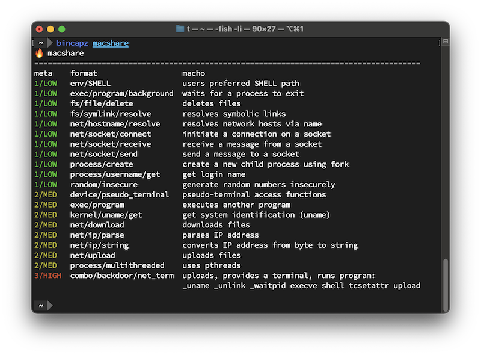

# bincapz


Enumerates program capabilities and malicious behaviors using fragment analysis.



## Features

- 14,500+ rules that detect everything from `ioctl`s to malware
- Analyzes binaries from any architecture
  - `arm64`, `amd64`, `riscv`, `ppc64`, `sparc64`
- CI/CD-friendly
- Diff-friendly output via Markdown, JSON, or YAML
- Integrates [YARA forge](https://yarahq.github.io/) for rules by Avast, Elastic, FireEye, Google, Nextron, and others
  - Other [third-party](third_party/README.md) rules are also included
- Support for archives
  - `.apk`, `.gem`, `.gz`, `.jar`, `.tar.gz`, `.tar.xz`, `.tar`, `.tgz`, and `.zip`
- Support for OCI images
- Support for scripting languages such as bash, PHP, Perl, Ruby, NodeJS, and Python
- Tuned for especially excellent performance with Linux programs

## Shortcomings

- Minimal rule support for Windows and Java (help wanted!)
- Early in development; output is subject to change

## Requirements

A container runtime environment such as Podman or Docker, or local developer tools:

- [go](https://go.dev/) 1.21+
  - Install via the official installer, `goenv`, Homebrew, or a preferred package manager
- [pkg-config](https://www.freedesktop.org/wiki/Software/pkg-config/) - included in many UNIX distributions
- [yara](https://virustotal.github.io/yara/)

## Installation

### Containerized

`docker pull cgr.dev/chainguard/bincapz:latest`

### Local

Install YARA (dependency):

```shell
brew install yara || sudo apt install libyara-dev \
  || sudo dnf install yara-devel || sudo pacman -S yara
```

Install bincapz:

```shell
go install github.com/chainguard-dev/bincapz@latest
```

## Usage

To inspect a binary, pass it as an argument to dump a list of predicted capabilities:

```shell
bincapz /bin/ping
```

There are flags for controlling output (see the Usage section) and filtering out rules. Here's the `--format=markdown` output:
| RISK | KEY | DESCRIPTION | EVIDENCE |
|--------|-----------------------------------------------------------------------------------------------------------------------------|-----------------------------------------------------------------------------------------------------------------------|--------------------------------------------------------------------------------------------------------------------------------------------------------------------------------------------------------------------------------------------------------------------------------------------------------|
| MEDIUM | [combo/net/scan_tool](https://github.com/chainguard-dev/bincapz/blob/main/rules/combo/net/scan_tool.yara#generic_scan_tool) | may scan networks | [connect](https://github.com/search?q=connect&type=code)<br>[gethostbyname](https://github.com/search?q=gethostbyname&type=code)<br>[port](https://github.com/search?q=port&type=code)<br>[scan](https://github.com/search?q=scan&type=code)<br>[socket](https://github.com/search?q=socket&type=code) |
| MEDIUM | [net/interface/list](https://github.com/chainguard-dev/bincapz/blob/main/rules/net/interface-list.yara#bsd_ifaddrs) | list network interfaces | [freeifaddrs](https://github.com/search?q=freeifaddrs&type=code)<br>[getifaddrs](https://github.com/search?q=getifaddrs&type=code) |
| MEDIUM | [net/ip/string](https://github.com/chainguard-dev/bincapz/blob/main/rules/net/ip-string.yara#inet_ntoa) | [converts IP address from byte to string](https://linux.die.net/man/3/inet_ntoa) | [inet_ntoa](https://github.com/search?q=inet_ntoa&type=code) |
| MEDIUM | [net/socket/connect](https://github.com/chainguard-dev/bincapz/blob/main/rules/net/socket-connect.yara#_connect) | [initiate a connection on a socket](https://linux.die.net/man/3/connect) | [\_connect](https://github.com/search?q=_connect&type=code) |
| LOW | [net/hostname/resolve](https://github.com/chainguard-dev/bincapz/blob/main/rules/net/hostname-resolve.yara#gethostbyname2) | [resolve network host name to IP address](https://linux.die.net/man/3/gethostbyname2) | [gethostbyname2](https://github.com/search?q=gethostbyname2&type=code) |
| LOW | [net/icmp](https://github.com/chainguard-dev/bincapz/blob/main/rules/net/icmp.yara#icmp) | [ICMP (Internet Control Message Protocol), aka ping](https://en.wikipedia.org/wiki/Internet_Control_Message_Protocol) | [ICMP](https://github.com/search?q=ICMP&type=code) |
| LOW | [net/interface/get](https://github.com/chainguard-dev/bincapz/blob/main/rules/net/interface-get.yara#bsd_if) | get network interfaces by name or index | [if_nametoindex](https://github.com/search?q=if_nametoindex&type=code) |
| LOW | [net/ip](https://github.com/chainguard-dev/bincapz/blob/main/rules/net/ip.yara#packets) | access the internet | [invalid packet](https://github.com/search?q=invalid+packet&type=code) |
| LOW | [net/ip/multicast/send](https://github.com/chainguard-dev/bincapz/blob/main/rules/net/ip-multicast-send.yara#multicast) | [send data to multiple nodes simultaneously](https://en.wikipedia.org/wiki/IP_multicast) | [multicast](https://github.com/search?q=multicast&type=code) |
| LOW | [net/ip/resolve](https://github.com/chainguard-dev/bincapz/blob/main/rules/net/ip-resolve.yara#gethostbyaddr) | [resolves network hosts via IP address](https://linux.die.net/man/3/gethostbyaddr) | [gethostbyaddr](https://github.com/search?q=gethostbyaddr&type=code) |
| LOW | [net/ip/send/unicast](https://github.com/chainguard-dev/bincapz/blob/main/rules/net/ip-send-unicast.yara#unicast) | send data to the internet | [unicast](https://github.com/search?q=unicast&type=code) |
| LOW | [net/socket/receive](https://github.com/chainguard-dev/bincapz/blob/main/rules/net/socket-receive.yara#recvmsg) | [receive a message from a socket](https://linux.die.net/man/2/recvmsg) | [recvmsg](https://github.com/search?q=recvmsg&type=code) |
| LOW | [net/socket/send](https://github.com/chainguard-dev/bincapz/blob/main/rules/net/socket-send.yara#sendmsg) | [send a message to a socket](https://linux.die.net/man/2/sendmsg) | [\_send](https://github.com/search?q=_send&type=code)<br>[sendmsg](https://github.com/search?q=sendmsg&type=code)<br>[sendto](https://github.com/search?q=sendto&type=code) |
| LOW | [process/userid/set](https://github.com/chainguard-dev/bincapz/blob/main/rules/process/userid-set.yara#setuid) | [set real and effective user ID of current process](https://man7.org/linux/man-pages/man2/setuid.2.html) | [setuid](https://github.com/search?q=setuid&type=code) |

To only show output for the most suspicious behaviors, use `--min-risk=3`, which shows only "HIGH" or "CRITICAL" behaviors.

## Diff mode to detect supply-chain attacks

Let's say you are a company that is sensitive to supply-chain compromises. You want to make sure an update doesn't introduce unexpected capability changes. There's a `--diff` mode for that:

```shell
bincapz -diff old_ffmpeg.dylib new_ffmpeg.dylib
```

Here is a result using the 3CX compromise as a test case. Each of the lines that beginsl with a "+" represent a newly added capability.

## Changed: . [⚠️ MEDIUM → 🚨 CRITICAL]

### 20 new behaviors

| RISK      | KEY                                                                                                                                                                                     | DESCRIPTION                                                                                                                                                                                                             | EVIDENCE                                                                                                                                                                                                                                                             |
| --------- | --------------------------------------------------------------------------------------------------------------------------------------------------------------------------------------- | ----------------------------------------------------------------------------------------------------------------------------------------------------------------------------------------------------------------------- | -------------------------------------------------------------------------------------------------------------------------------------------------------------------------------------------------------------------------------------------------------------------- |
| +CRITICAL | **[3P/signature_base/3cxdesktopapp/backdoor](https://github.com/Neo23x0/signature-base/blob/1b9069ac3d8d5b6dd2b61d3c934bf19b70323011/yara/gen_mal_3cx_compromise_mar23.yar#L251-L275)** | [Detects 3CXDesktopApp MacOS Backdoor component](https://www.volexity.com/blog/2023/03/30/3cx-supply-chain-compromise-leads-to-iconic-incident/), by X\_\_Junior (Nextron Systems)                                      | $op1<br>$op2<br>[%s/.main_storage](https://github.com/search?q=%25s%2F.main_storage&type=code)<br>[%s/UpdateAgent](https://github.com/search?q=%25s%2FUpdateAgent&type=code)                                                                                         |
| +CRITICAL | **[3P/signature_base/nk/3cx](https://github.com/Neo23x0/signature-base/blob/1b9069ac3d8d5b6dd2b61d3c934bf19b70323011/yara/gen_mal_3cx_compromise_mar23.yar#L188-L214)**                 | [Detects malicious DYLIB files related to 3CX compromise](https://www.sentinelone.com/blog/smoothoperator-ongoing-campaign-trojanizes-3cx-software-in-software-supply-chain-attack/), by Florian Roth (Nextron Systems) | $xc1<br>$xc2<br>$xc3                                                                                                                                                                                                                                                 |
| +CRITICAL | **[3P/signature_base/susp/xored](https://github.com/Neo23x0/signature-base/blob/1b9069ac3d8d5b6dd2b61d3c934bf19b70323011/yara/gen_xor_hunting.yar#L2-L20)**                             | [Detects suspicious single byte XORed keyword 'Mozilla/5.0' - it uses yara's XOR modifier and therefore cannot print the XOR key](<https://gchq.github.io/CyberChef/#recipe=XOR_Brute_Force()>), by Florian Roth        | $xo1                                                                                                                                                                                                                                                                 |
| +CRITICAL | **[3P/volexity/iconic](https://github.com/volexity/threat-intel/blob/62e031ea574efde68dac7d38dc23438466a5302b/2023/2023-03-30%203CX/indicators/rules.yar#L32-L50)**                     | [Detects the MACOS version of the ICONIC loader.](https://www.reddit.com/r/crowdstrike/comments/125r3uu/20230329_situational_awareness_crowdstrike/), by threatintel@volexity.com                                       | $str1<br>$str2<br>$str3                                                                                                                                                                                                                                              |
| +CRITICAL | **[evasion/xor/user_agent](https://github.com/chainguard-dev/bincapz/blob/main/rules/evasion/xor-user_agent.yara#xor_mozilla)**                                                         | XOR'ed user agent, often found in backdoors, by Florian Roth                                                                                                                                                            | $Mozilla_5_0                                                                                                                                                                                                                                                         |
| +MEDIUM   | **[exec/pipe](https://github.com/chainguard-dev/bincapz/blob/main/rules/exec/pipe.yara#popen)**                                                                                         | [launches program and reads its output](https://linux.die.net/man/3/popen)                                                                                                                                              | [\_pclose](https://github.com/search?q=_pclose&type=code)<br>[\_popen](https://github.com/search?q=_popen&type=code)                                                                                                                                                 |
| +MEDIUM   | **[fs/permission/modify](https://github.com/chainguard-dev/bincapz/blob/main/rules/fs/permission-modify.yara#chmod)**                                                                   | [modifies file permissions](https://linux.die.net/man/1/chmod)                                                                                                                                                          | [chmod](https://github.com/search?q=chmod&type=code)                                                                                                                                                                                                                 |
| +MEDIUM   | **[net/http/cookies](https://github.com/chainguard-dev/bincapz/blob/main/rules/net/http-cookies.yara#http_cookie)**                                                                     | [access HTTP resources using cookies](https://developer.mozilla.org/en-US/docs/Web/HTTP/Cookies)                                                                                                                        | [Cookie](https://github.com/search?q=Cookie&type=code)<br>[HTTP](https://github.com/search?q=HTTP&type=code)                                                                                                                                                         |
| +MEDIUM   | **[net/url/request](https://github.com/chainguard-dev/bincapz/blob/main/rules/net/url-request.yara#requests_urls)**                                                                     | requests resources via URL                                                                                                                                                                                              | [NSMutableURLRequest](https://github.com/search?q=NSMutableURLRequest&type=code)                                                                                                                                                                                     |
| +MEDIUM   | **[ref/path/hidden](https://github.com/chainguard-dev/bincapz/blob/main/rules/ref/path/hidden.yara#dynamic_hidden_path)**                                                               | [hidden path generated dynamically](https://objective-see.org/blog/blog_0x73.html)                                                                                                                                      | [%s/.main_storage](https://github.com/search?q=%25s%2F.main_storage&type=code)                                                                                                                                                                                       |
| +MEDIUM   | **[shell/arbitrary_command/dev_null](https://github.com/chainguard-dev/bincapz/blob/main/rules/shell/arbitrary_command-dev_null.yara#cmd_dev_null)**                                    | runs commands, discards output                                                                                                                                                                                          | ["%s" >/dev/null](https://github.com/search?q=%22%25s%22+%3E%2Fdev%2Fnull&type=code)                                                                                                                                                                                 |
| +LOW      | **[compression/gzip](https://github.com/chainguard-dev/bincapz/blob/main/rules/compression/gzip.yara#gzip)**                                                                            | [works with gzip files](https://www.gnu.org/software/gzip/)                                                                                                                                                             | [gzip](https://github.com/search?q=gzip&type=code)                                                                                                                                                                                                                   |
| +LOW      | **[env/HOME](https://github.com/chainguard-dev/bincapz/blob/main/rules/env/HOME.yara#HOME)**                                                                                            | [Looks up the HOME directory for the current user](https://man.openbsd.org/login.1#ENVIRONMENT)                                                                                                                         | [HOME](https://github.com/search?q=HOME&type=code)<br>[getenv](https://github.com/search?q=getenv&type=code)                                                                                                                                                         |
| +LOW      | **[fs/lock/update](https://github.com/chainguard-dev/bincapz/blob/main/rules/fs/lock-update.yara#flock)**                                                                               | apply or remove an advisory lock on a file                                                                                                                                                                              | [flock](https://github.com/search?q=flock&type=code)                                                                                                                                                                                                                 |
| +LOW      | **[kernel/dispatch/semaphore](https://github.com/chainguard-dev/bincapz/blob/main/rules/kernel/dispatch-semaphore.yara#dispatch_sem)**                                                  | [Uses Dispatch Semaphores](https://developer.apple.com/documentation/dispatch/dispatch_semaphore)                                                                                                                       | [dispatch_semaphore_signal](https://github.com/search?q=dispatch_semaphore_signal&type=code)                                                                                                                                                                         |
| +LOW      | **[kernel/hostname/get](https://github.com/chainguard-dev/bincapz/blob/main/rules/kernel/hostname-get.yara#gethostname)**                                                               | [get computer host name](https://man7.org/linux/man-pages/man2/sethostname.2.html)                                                                                                                                      | [gethostname](https://github.com/search?q=gethostname&type=code)                                                                                                                                                                                                     |
| +LOW      | **[net/http/accept/encoding](https://github.com/chainguard-dev/bincapz/blob/main/rules/net/http-accept-encoding.yara#content_type)**                                                    | [set HTTP response encoding format (example: gzip)](https://developer.mozilla.org/en-US/docs/Web/HTTP/Headers/Accept-Encoding)                                                                                          | [Accept-Encoding](https://github.com/search?q=Accept-Encoding&type=code)                                                                                                                                                                                             |
| +LOW      | **[random/insecure](https://github.com/chainguard-dev/bincapz/blob/main/rules/random/insecure.yara#bsd_rand)**                                                                          | [generate random numbers insecurely](https://man.openbsd.org/rand)                                                                                                                                                      | [\_rand](https://github.com/search?q=_rand&type=code)<br>[srand](https://github.com/search?q=srand&type=code)                                                                                                                                                        |
| +LOW      | **[ref/path/home_library](https://github.com/chainguard-dev/bincapz/blob/main/rules/ref/path/home_library.yara#home_lib_path)**                                                         | path reference within ~/Library                                                                                                                                                                                         | [/System/Library/Frameworks/CoreFoundation](https://github.com/search?q=%2FSystem%2FLibrary%2FFrameworks%2FCoreFoundation&type=code)<br>[/System/Library/Frameworks/Foundation](https://github.com/search?q=%2FSystem%2FLibrary%2FFrameworks%2FFoundation&type=code) |
| +LOW      | **[sync/semaphore/user](https://github.com/chainguard-dev/bincapz/blob/main/rules/sync/semaphore-user.yara#semaphore_user)**                                                            | uses semaphores to synchronize data between processes or threads                                                                                                                                                        | [semaphore_create](https://github.com/search?q=semaphore_create&type=code)<br>[semaphore_signal](https://github.com/search?q=semaphore_signal&type=code)<br>[semaphore_wait](https://github.com/search?q=semaphore_wait&type=code)                                   |

If you like to do things the hard way, you can also generate your own diff using JSON keys.

```shell
bincapz --format=json <file> | jq  '.Files.[].Behaviors | keys'
```

## Supported Flags

- `--all`: ignore nothing, show all
- `--data-files`: include files that are detected to as non-program (binary or source) files
- `--diff`: show capability drift between two files
- `--format` string: Output type. Valid values are: json, markdown, simple, terminal, yaml (default "terminal")
- `--ignore-self`: ignore the `bincapz` binary
- `--ignore-tags` string: Rule tags to ignore
- `--min-risk`: minimum suspicion level to report (1=low, 2=medium, 3=high, 4=critical) (default 1)
- `--oci`: scan OCI images
- `--omit-empty`: omit files that contain no matches
- `--profile`: capture profiling/tracing information for `bincapz`
- `--stats`: display statistics for risk level and `programkind`
- `--third-party`: include third-party rules, which may have licensing restrictions (default true)
- `--verbose`: turn on verbose output for diagnostic/troubleshooting purposes

## FAQ

### How does it work?

bincapz behaves similarly to the initial triage step most security analysts use when faced with an unknown binary: a cursory `strings` inspection. bincapz has several advantages over human analysis: the ability to match raw byte sequences, decrypt data, and a library of 14,500+ YARA rules that combines the experience of security engineers worldwide.

This strategy works, as every program leaves traces of its capabilities in its contents, particularly on UNIX platforms. These fragments are typically `libc` or `syscall` references or error codes. Scripting languages are easier to analyze due to their cleartext nature and are also supported.

### Why not properly reverse-engineer binaries?

Mostly because fragment analysis is so effective. Capability analysis through reverse engineering is challenging to get right, particularly for programs that execute other programs, such as malware that executes `/bin/rm`. Capability analysis through reverse engineering that supports a wide array of file formats also requires significant engineering investment.

### Why not just observe binaries in a sandbox?

The most exciting malware only triggers when the right conditions are met. Nation-state actors, in particular, are fond of time bombs and locale detection. bincapz will enumerate the capabilities, regardless of conditions.

### Why not just analyze the source code?

Sometimes you don't have it! Sometimes your CI/CD infrastructure is the source of compromise. Source-code-based capability analysis is also complicated for polyglot programs, or programs that execute external binaries, such as `/bin/rm`.

### How does bincapz work for packed binaries (UPX)?

bincapz alerts when an obfuscated or packed binary is detected, such as those generated by [upx](https://github.com/upx/upx). Fragment analysis may still work to a lesser degree. For the full story, we recommend unpacking binaries first.

### What related software is out there?

bincapz was initially inspired by [mandiant/capa](https://github.com/mandiant/capa). While capa is a fantastic tool, it only works on x86-64 binaries (ELF/PE), and does not work for macOS programs, arm64 binaries, or scripting languages. <https://karambit.ai/> and <https://www.reversinglabs.com/> offer capability analysis through reverse engineering as a service. If you require more than what bincapz can offer, such as Windows binary analysis, you should check them out.

### How can I help?

If you find malware that `bincapz` doesn't surface suspicious behaviors for, send us a patch! All of the rules are defined in YARA format, and can be found in the `rules/` folder.

### Troubleshooting

#### Profiling

`bincapz` can be profiled by running `--profile=true`. This will generate timestamped profiles in an untracked `profiles` directory:
```
bash-5.2$ ls -l profiles/ | grep -v "total" | awk '{ print $9 }'
cpu_329605000.pprof
mem_329605000.pprof
trace_329605000.out
```

The traces can be inspected via `go tool pprof` and `go tool trace`.

For example, the memory profile can be inspected by running:
```
go tool pprof -http=:8080 profiles/mem_<timestamp>.pprof
```

#### Error: ld: library 'yara' not found

If you get this error at installation:

```
ld: library 'yara' not found
```

The `yara` C library is required:

```
brew install yara || sudo apt install libyara-devel || sudo dnf install yara-devel || sudo pacman -S yara
```

Additionally, ensure that Yara's version is `4.3.2`.

If this version is not available via package managers, manually download the release from [here](https://github.com/VirusTotal/yara/releases) and build it from source by following [these](https://yara.readthedocs.io/en/latest/gettingstarted.html#compiling-and-installing-yara) steps.

Once Yara is installed, run `sudo ldconfig -v` to ensure that the library is loaded.
