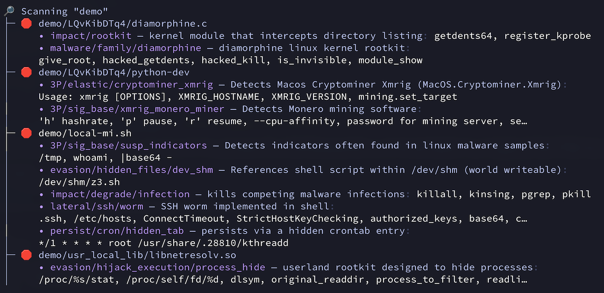

```
   _ _    _.  .    _   _    _  .  ___   _.   _  .  ___
  ( | )  (_|  |_  (_  (_)  ( \_)   |   (/_  ( \_)   |
  
     overtly paranoid open-source malware scanner
```

malcontent is a malware scanner and analysis tool for high-risk environments such as CI/CD pipelines. It's goal is to reveal hitherto undiscovered malware, so it is overtly paranoid and highly prone to false positives.

malcontent offers 3 modes of operation depending on your use case:

* `analyze`: deep analysis of a programs capabilities
* `diff`: show the capability differences between two versions of a program
* `scan`: basic malware scanner

*WARNING: This tool is in early development and raises more false-positives than even we would like. We're working on it :)*

## Features

- 15,300+ open-source YARA rules
- Analyzes binaries from almost any architecture (arm64, amd64, riscv, ppc64, sparc64), format (ELF, machO, PE),
- Analyzes programs for almost any operating system (Linux, macOS, OpenBSD, FreeBSD, Solaris, Windows)
- Analyzes scripts in almost any language (PERL, Python, shell, Javascript, Typescript, PHP)
- Transparent archive support (`.apk`, `.gem`, `.gz`, `.jar`, `.tar.gz`, `.tar.xz`, `.tar`, `.tgz`, and `.zip`) and OCI archives
- Multiple output formats (JSON, YAML, Markdown, Terminal)
- Includes 3rd party YARA rules from esteemed organizations such as Avast, Elastic, FireEye, Google, JP-CERT, Nextron, and others

## Modes

### Analyze

To analyze a program, pass the path as an argument to `mal analyze`. For example:


The analyze mode emits a list of capabilities that are often seen in malware, categorized by risk level. In general, `CRITICAL` findings should be considered malicious.

### Diff

To detect unexpected capability changes, we have a `diff` mode. Using the [3CX Compromise](https://www.fortinet.com/blog/threat-research/3cx-desktop-app-compromised) as an example:


Each of the lines that beginsl with a "+" represent a newly added capability. For use in CI/CD pipelines, you may find the following flags useful:

It's worth noting that none of the "CRITICAL" findings, except for the `evasnion/xor/user_agent`, would have been found pre-3CX compromise. The diff mode is designed to surface subtle unexpected changes that you might not have an explatanion for, such as "why does `libffmpeg.dylib` need access to `chown`?

* `--format=markdown`: output in markdown for use in GitHub Actions
* `--min-file-risk=critical`: only show diffs for critical-level changes
* `--quantity-increases-risk=false`: disable the heuristics that increase file criticality due to result frequency

### Scan



Like other commands, you can even point this tool at a container image: `mal scan --i cgr.dev/chainguard/nginx`

Useful flags:

* `--include-data-files`: Include files that are detected as non-program (binary or source) files

## Installation

### Containerized

`docker pull cgr.dev/chainguard/malcontent:latest`

### Local

Requirements:

- [go](https://go.dev/) - the programming language
- [pkg-config](https://www.freedesktop.org/wiki/Software/pkg-config/) - for dependency handling, included in many UNIX distributions
- [yara](https://virustotal.github.io/yara/) - the rule language

On Linux and macOS, you can run this to install YARA:

```shell
brew install yara || sudo apt install libyara-dev \
  || sudo dnf install yara-devel || sudo pacman -S yara
```

then:

```shell
go install github.com/chainguard-dev/malcontent/cmd/mal@latest
```

## Help Wanted


malcontent is an honest-to-goodness open-source project: if you are interested in contributing, check out [DEVELOPMENT.md](DEVELOPMENT.md)