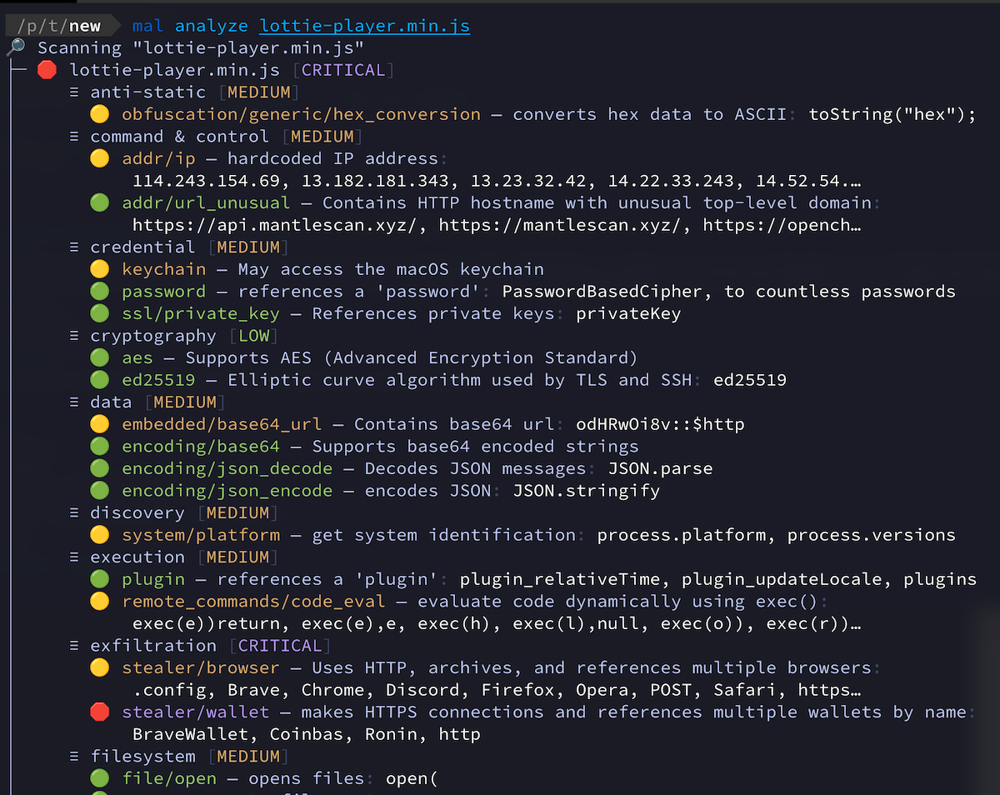
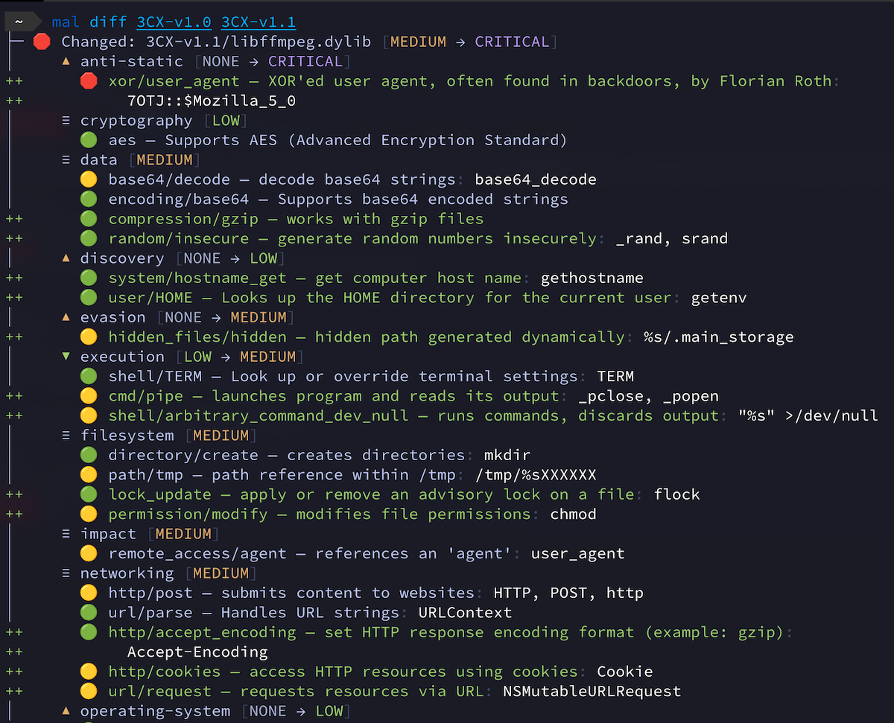

# malcontent

```text
 _ _    _.  .    _   _    _  .  ___   _.   _  .  ___
( | )  (_|  |_  (_  (_)  ( \_)   |   (/_  ( \_)   |
  
      the paranoid open-source malware scanner
```

malcontent is a malware scanner and analysis tool for high-risk environments such as CI/CD pipelines. Its goal is to reveal novel undiscovered malware,
and is overtly paranoid and highly prone to false positives.

malcontent offers 3 modes of operation depending on your use case:

* `scan`: find malicious content across a variety of file formats
* `analyze`: deep analysis of a program's capabilities
* `diff`: show the capability differences between two versions of a program

*NOTE: malcontent is a work in progress and has a higher false-positive rate than we would like; we're working on it!*

## Features

* 16,000+ [YARA](YARA) detection rules!
  * Including third-party rules from esteemed organizations such as Avast, Elastic, FireEye, Mandiant, Nextron, ReversingLabs, and more!
* Analyzes binaries for nearly any environment (Linux, macOS, Windows, etc.)
* Analyzes scripts (Python, shell, Javascript, Typescript, PHP, Perl)
* Analyzes container images
* Transparent archive support (apk, tar, zip, etc.)
* Multiple output formats (JSON, YAML, Markdown, Terminal)

## Modes

### Scan

Scan directories for possible malware:


You can also scan a container image: `mal scan -i cgr.dev/chainguard/nginx:latest`

Useful flags:

* `--include-data-files`: Include files that do not appear to be programs
* `--processes`: scan active process binaries (experimental)

### Analyze

To analyze the capabilities of a program, use `mal analyze`. For example:



The analyze mode emits a list of capabilities often seen in malware, categorized by risk level. It works with programs in a wide variety of file formats and scripting languages.

`CRITICAL` findings should be considered malicious. Useful flags include:

* `--format=json`: output to JSON for data parsing
* `--min-risk=high`: only show high or critical risk findings

### Diff

To detect unexpected capability changes, try `diff` mode. Using the [3CX Compromise](https://www.fortinet.com/blog/threat-research/3cx-desktop-app-compromised) as an example, we're able to use malcontent to detect malicious code inserted in an otherwise harmless library:



Each line that begins with a "+" represents a newly added capability.You can use it to diff entire directories recursively, even if they contain programs written in a variety of languages.

For use in CI/CD pipelines, you may find the following flags helpful:

* `--format=markdown`: output in markdown for use in GitHub Actions
* `--min-file-risk=critical`: only show diffs for critical-level changes
* `--quantity-increases-risk=false`: disable heuristics that increase file criticality due to result frequency

## Installation

### Container

`docker pull cgr.dev/chainguard/malcontent:latest`

### Local

Requirements:

* [yara](https://virustotal.github.io/yara/) - the rule language
* [go](https://go.dev/) - the programming language
* [pkg-config](https://www.freedesktop.org/wiki/Software/pkg-config/) - for dependency handling, included in many UNIX distributions

For example, to install the YARA library on Linux or macOS:

```shell
brew install yara || sudo apt install libyara-dev \
  || sudo dnf install yara-devel || sudo pacman -S yara
```

Install malcontent:

```shell
go install github.com/chainguard-dev/malcontent/cmd/mal@latest
```

## Help Wanted


malcontent is an honest-to-goodness open-source project: if you are interested in contributing, check out [DEVELOPMENT.md](DEVELOPMENT.md)
